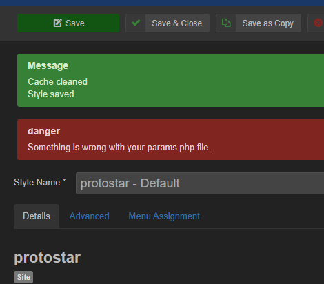
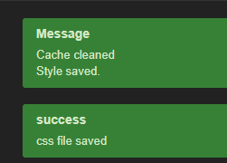

# BearsOnSave
Simple Joomla Plugin to process template parameters into compressed .css file on save.

When the user clicks on save, gather all the parameters in the template & process them into a file called params.css. it is NOT necessary to save the existing file. Simply overwrite it. This file should be loaded JUST before custom.css as it really IS it's own custom.css modifying what is normally in the template. Once this is done we SHOULD be able to remove all parsing from template backend. This should speed up things ENORMOUSLY!
MUST only trigger when active template uses save not during any other time.
 
 

***How to test:***

- Make sure the plugin is active. 
- go to protostar ( it can be any template but our test params.php file is designed for protostar ) 
- click save. 
- you should get the following warning..

 
- now copy the params.php file into the base folder of the template. 
- click save. 
- you should now get

 

- there should now be the following files created in the '/css' folder of your template. 
 .	".backup.custom.css" 
 . 	"custom.css" 
 .	"bos.css"  ( it should match the filename in the plugin ) 

- Change the filename in the plugin to some other filename. 
- retest
- You should get everythign as before but the filename should match the plugin filename. 

If you get anything else please create an issue.
